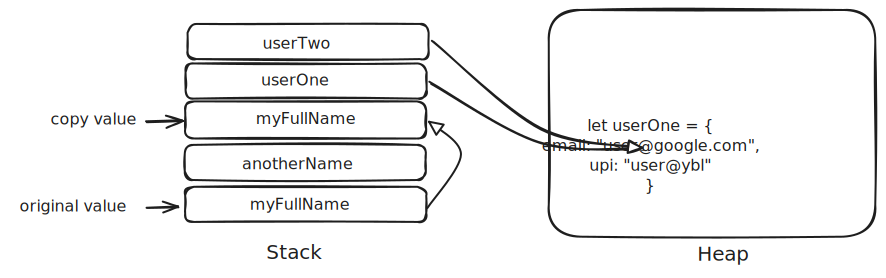

## Day 02 
### 1. Comparison of data types and Type Coercion
#### Key Concepts :
- **Comparison Operators**: Operators used to compare two values (e.g., `==`, `===`, `!=`, `!==`, `<`, `>`, `<=`, `>=`).
- **Type Coercion**: The automatic or implicit conversion of values from one data type to another (e.g., converting a string to a number).
#### Notes :
- Comparison operators return a boolean value (`true` or `false`).
- `==` (Equality): Compares two values for equality after performing type coercion if necessary.
- `===` (Strict Equality): Compares two values for equality without performing type coercion. Both value and type must be the same.
- `!=` (Inequality): Compares two values for inequality after performing type coercion if necessary.
- `!==` (Strict Inequality): Compares two values for inequality without performing type coercion. Both value and type must be different.
- `<` (Less Than): Checks if the value on the left is less than the value on the right.
- `>` (Greater Than): Checks if the value on the left is greater than the value on the right.
- `<=` (Less Than or Equal To): Checks if the value on the left is less than or equal to the value on the right.
- `>=` (Greater Than or Equal To): Checks if the value on the left is greater than or equal to the value on the right.
- Type coercion can lead to unexpected results, especially when comparing different data types.

### 2. Data type summary
#### Key Concepts :
- **Primitive Data Types**: The most basic data types in JavaScript, including:
  - **Number**: Represents both integer and floating-point numbers.
  - **String**: Represents a sequence of characters.
  - **Boolean**: Represents a logical value (`true` or `false`).
  - **Null**: Represents the intentional absence of any object value.
  - **Undefined**: Represents a variable that has been declared but has not yet been assigned a value.
  - **Symbol**: Represents a unique and immutable value, often used as object property keys.
- **Reference Data Types**: More complex data types that refer to objects, including:
  - **Object**: A collection of key-value pairs.
  - **Array**: An ordered list of values.
  - **Function**: A callable object that can be invoked.
#### Interview perspective notes on data types :
- Understand the differences between primitive and reference data types.
- Be prepared to explain type coercion and its implications in JavaScript.
- Familiarize yourself with common pitfalls related to data types, such as comparing different types or using `==` vs `===`.
- Practice coding exercises that involve data type conversions and comparisons to solidify your understanding.

### 3. Memory in JavaScript
#### Key Concepts :
- **Stack Memory**: Used for static memory allocation and function call management. It stores primitive data types and function calls.
- **Heap Memory**: Used for dynamic memory allocation. It stores reference data types like objects and arrays.

#### Stack vs Heap Memory Diagram :


#### Stack (Primitive) 
````
let myFullName = "Dnayneshwar Pravin More"

let anotherName = myFullName
anotherName = "dnano-more"

Stack: ┌─────────────────────────────┐ │ myFullName | "Dnayneshwar Pravin More" │ │ anotherName | "dnano-more" │ └─────────────────────────────┘
````
#### Heap (Reference) 
````
let userOne = {
    email: "user@google.com",
    upi: "user@ybl"
}

let userTwo = userOne
userOne.email = "dano@google.com"

Stack: Heap: ┌────────────┐ ┌────────────────────────────┐ │ userOne │ ──────────────▶│ { email: "dano@google.com",│ │ userTwo │ ──────────────▶│ upi: "user@ybl" } │ └────────────┘ └────────────────────────────┘
````
 In stack, primitives are copied by value. In heap, objects are referenced, so changes affect all references.


#### Notes :    
- Primitive data types (Number, String, Boolean, Null, Undefined, Symbol) are stored in stack memory.
- Reference data types (Object, Array, Function) are stored in heap memory, and the stack holds a reference (or pointer) to the location in the heap.
- Understanding memory allocation is crucial for optimizing performance and managing resources in JavaScript applications.
#### Interview perspective notes on memory :
- Be able to explain the difference between stack and heap memory.  
- Understand how JavaScript manages memory for different data types.
- Be prepared to discuss memory leaks and how to avoid them in JavaScript applications.